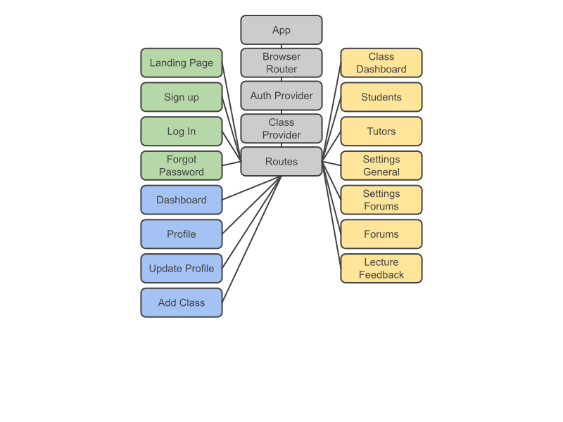
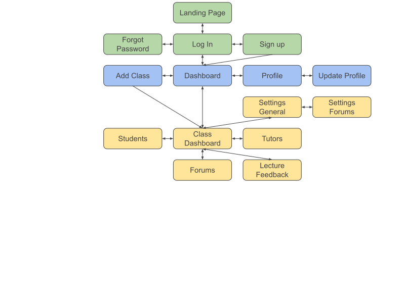
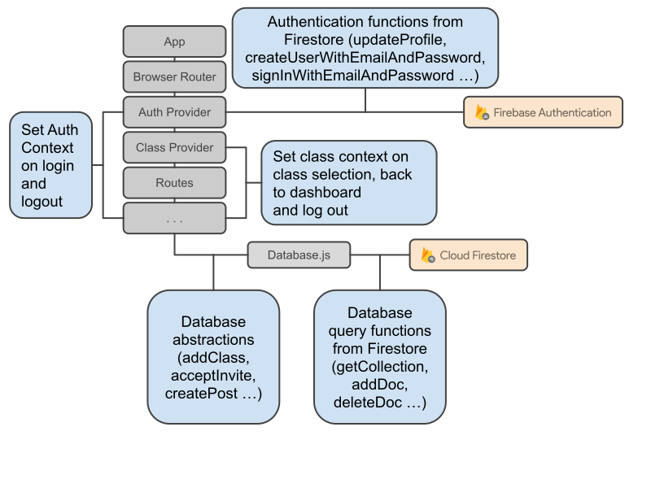

# NUS Orbital AY21/22 Milestone 2

### Snail Express
Post your train of thought

## Project Details

**Project Name:** Snail Express

**Team Name:** Team Snail

**Proposed** Level of Achievement: Gemini

**Adviser:** Yap Dian Hao

**Team Members:** Goh Yong Jing, Nicholas Seah

## Project Scope

Snail Express is a gamified platform that encourages learning through discussion and interaction between students and lecturers.

We aim to integrate the functionalities of some existing platforms - like Piazza (forum) and Archipelago (real-time interactive poll) and Coursemology (gamified through XP reward system and leaderboard) - into a single application.

Summary of each platform:
- **Piazza:** Q&A forum designed for students and teachers to answer offline questions; questions are archivable and can be referred to at any time.
- **Archipelago:** Real-time quiz system that allows lecturers to ask students questions for a quick check of understanding.
- **Coursemology:** Gamified submission platform that uses XP points and levelling up to encourage students to participate actively.

Our project should improve on and combine the benefits of a real-time quiz with that of a forum. We aim to achieve a good mix of lengthy discussions and short answer replies to fast questions, both during the lecture and offline for revision. Lecturers will be able to receive real-time feedback on the lesson, test the students' understanding of the lecture content, answer students’ questions and also promote interaction and participation in the class through gamification of the platform.

## Motivation

CS2040S uses Archipelago for almost every lecture, but we find it lacking in features which might be useful as a classroom poll application. For example: 

- Students do not have access to real-time statistics on other students’ responses.
- The session closes once the lecture is over, but students might want to refer back to questions that were being posed.
- The interface is too basic, only allowing students to submit short-answer responses, select an MCQ response, or upvote questions by other students.
- Some questions asked are repetitive, or have already been answered before
- Students are also unable to answer questions posed by other students. The interface should provide for such a functionality, especially if the lecturer is unable to go through all the questions, so that the students can help to clarify each other's doubts for fast/random questions.

## User Stories

**Students’ perspective**

1. As a student, I want to be able to ask questions during the lecture and get quick replies from either the lecturer or other students. I also want to indicate that I have a similar question to another student so that the lecturer can prioritise the common questions. I want to indicate that someone's answer is good because it answered my queries.

2. As a student, I want to be able to indicate to the lecturer in real time that they are going too fast or too slow, or that I am unable to understand what has been taught in the past ten minutes.

3. As a student, I want to feel appreciated when I answer another student’s questions.

**Lecturer’s perspective**

1. As a lecturer, I want to make sure my students are following the lecture content so that I know when to stop and clarify doubts before moving on. I hope this can be done by surveying students passively (in the background) without the need to open a new poll during the lecture. 

2. As a lecturer, I hope to be able to quantify my students’ participation without having to micromanage the chat. I want a platform which can store students’ responses and report them to me after the lecture so I can award participation points in a hassle-free manner.

3. As a lecturer, it is stressful to answer the students’ questions while conducting the lecture. I hope to be able to refer to these questions after the lecture and answer them offline. 

4. As a lecturer, I also hope that students can aid in answering the questions submitted by other students because I value their input as well. I hope to be able to remove erroneous responses and endorse good responses.

## Features

The features of snail express are described below.

Lecturers, teaching assistants and students all use the same **User** account type.
- **Users** can:
  - Update account email and password
  - Create a new **Class** (where they will be assigned the **Role** of **Head Tutor**) and invite **Users** to join with the role of a **Student** or **Tutor**
  - Accept or delete invites by **Head Tutors** to join their **Class** with the **Role** of **Student** or **Tutor**

**Users** are exposed to different sets of functionality based on their **Role** in a **Class**.
- **Head Tutor**
  - A **User** creating a **Class** is assigned this **Role**. There can only be one **Head Tutor** per **Class**.
  - **Head Tutors** can:
    - Invite and remove **Tutors** and **Students** to their **Class**.
    - Leave the **Class** (Which will delete the **Class** and all its contents and assigned **Roles**)
- **Tutor**
  - A **User** accepting an invite to join a **Class** as a **Tutor** is assigned this **Role**.
  - **Tutors** can
    - Invite and remove **Students** in their **Class**
    - Leave the **Class**
- **Student**
  - A **User** accepting an invite to join a **Class** as a **Student** is assigned this **Role**.
  - **Students** can:
    - Leave the **Class**

A **Class** has a set of features for lecturers, teaching assistants and students to interact and perform their tasks. 
- **Forums**
  - Forums facilitate discussion among users after class hours.
  - Head Tutors, Tutors and Students can:
    - Post in discussion threads
    - Reply to posts
    - Upvote or downvote posts and replies
    - See each other's posts, replies, upvotes, downvotes as well as posts marked as endorsed by Tutors and Head Tutors
    - React to posts and replies with emojis and see each other's reactions
    - Format their text (bold, italics, underline and format as code)
  - Head Tutors and Tutors can:
    - Create discussion threads
    - Mark a post or reply as endorsed
- **Quiz**
  - Quizzes are interactive sessions between lecturers and students that is held in real time
  - Quiz types:
    - Multiple Choice Questions (MCQ): Given a question, students choose 1 correct answer out of several choices
    - Multiple Response Questions (MRQ): Given a question, students choose several correct answers out of several choices
    - Open Ended Questions: Given a question, students type in their answer in text form.
  - Head Tutors and Tutors can:
    - Hold quizzes and set questions and answers
    - See Students' participation and answer
  - Students can:
    - Participate in the quiz and answer questions
    - Check whether their answer is correct and see their ranking among the class
- **Lecture Feedback**
  - Lecture Feedbacks allow students to provide feedback in real time during a lecture
  - **Students** can:
    - Provide feedback to the **Head Tutors** and **Tutors**:
      - Too Fast: Indicate that the lecturer is going too fast
      - Too Slow: Indicate that the lecturer is going too slow
      - Confused: Indicate to the lecturer that the student is confused and require further explanation or rephrasing by lecturer
      - Good Pace: Indicate to the lecturer that the lesson is going well and there are no issues
  - **Head Tutors** and **Tutors** can:
    - View the feedback given by **Students**

## Plans

**Liftoff**
- Ideation: Sketch and design of website
**Milestone 1**
- User account: Basic account creation, login and logout system
**Milestone 2**
- Classes: Create classes and send, accept and delete invitations to classes
- Forums: View and create threads, posts and replies, as well as react to them using upvotes, downvotes and endorsements.
- Lecture Feedback: Send and view lecture feedback
**Milestone 3**
- Classes: Complete remaining features - delete users, leave class, delete class
- Forums: Complete remaining features - edit and delete threads, posts and replies
- Quizzes: create quiz questions, answers and attend quizzes
- Gamification: gain exp through using any features of the platform, level up and gain titles
**Splashdown**
- Additional Forum Features: React to other students’ questions and answers by upvoting or reacting with an emoji. Format text in bold, underline and italics
- Additional Quiz Features: Add MRQ and open ended questions
- Additional Gamification features: Customise the rank titles of students, number of questions each student can ask to prevent spam, experience points awarded per question, maximum upvotes per day.

## Tech Stack

**Frontend**: ReactJS

ReactJS is a framework to structure web pages using reusable components such as forum posts, navigation bars and buttons. The Snail Express website layout is shown below
Public pages are shown in green. Users can access these pages when they are not logged in.
Authenticated pages are shown in blue. Users can access these pages when they are logged in but do not need to have a specific class selected.
Class pages are shown in yellow. Users can access these pages when they are logged in and have selected a specific class to interact with.

**React Component Tree**

**Activity Diagram**

If a user attempts to visit a page without meeting the necessary requirements, they get redirected to their proper webpages. This is done using React’s context providers, which allows every single webpage to see and change the authentication and class context as necessary.

**Database**: Firebase Cloud Firestore

Cloud Firestore uses the “Collections and Documents” data model to store information. Collections store 1 or more different documents and documents are simple JSON-like objects that store key value pairs for simple data structures such as strings, numbers, simple non-nested arrays as well as other subcollections. This simple nesting of collections and documents allow for a complex database structure for Snail Express as shown below, with collections labelled 📁 and documents labelled 📄.

📁 Classes
- 📄 Class
  - Class name (string)
  - Head Tutor Id (string)
  - Head Tutor Email (string)
  - Student Invites (array<string>)
  - Tutor Invites (array<string>)
  - Student Ids (array<string>)
  - Tutor Ids (array<string>)
  - 📁 Students
    - 📄 Student
      - Student Email (string)
      - Student Id (string)
  - 📁 Tutors
    - 📄 Tutor
      - Tutor Email (string)
      - Tutor Id (string)
  - 📁 Forum Threads
    - 📄 Forum Thread
      - Thread Name (string)
      - 📁 Forum Posts
        - 📄 Forum Post
          - Post Title (string)
          - Post Body (string)
          - Post Author Email (string)
          - Post Author Id (string)
          - Post Endorsed (boolean)
          - Post Upvoters (array<string>)
          - Post Downvoters (array<string>)
          - 📁 Forum Post Replies
             - 📄 Forum Post Reply
              - Reply Body (string)
              - Reply Author Email (string)
              - Reply Author Id (string)
              - Reply Endorsed (boolean)
              - Reply Upvoters (array<string>)
              - Reply Downvoters (array<string>)

In Cloud Firestore, usage limits and billing are tabulated per document read, write and delete where only part of a collection is retrieved based on some condition instead of retrieving the entire collection. Subcollections within a document are also not automatically retrieved and require explicit query to read, write or delete. Cloud Firestore also uses the philosophy that reads happen much more often than writes and therefore optimises reading over writing.

With this in mind, we made the following design decisions:

In a class document, invites are shallow arrays of emails. This allows for tutors to invite students that have not created their account yet. When a user creates an account or logs in, we do a simple query for classes where the array of invites contains the user’s ID. Newly created user accounts with no invites incur 0 reads, even if Snail Express contains hundreds of classes.

In contrast, saving invites as a subcollection incurs many reads as the user needs to query all subcollections of all classes to check if their id exists in any of the subcollections.

In a post or reply document, upvoters, downvoters are shallow arrays of user ids. When a post is retrieved, the user incurs 1 read to view the post contents as well as number of upvotes and downvotes by simply using the length of the array.

In contrast, saving the upvotes and downvotes as a collection of documents incurs reads based on the total number of votes.

**Backend**: Firebase (Backend-as-a-Service)

We used the following backend services from Firebase to complete our project.
- Firebase Authentication
- Firebase Hosting

**Overview**:

## Evaluation

**Software engineering practices**

- Incremental development using atomic commits
- Version control and feature branching
- Using pull requests and resolving merge conflicts as a team
- Using issues tracker and milestones on GitHub
- Modular components in code base
- Abstraction and separation of concerns of frontend and backend via utility functions

**Testing**

Before deploying the application, we performed some user testing and fixed minor bugs and styling issues. We then conducted some simple user testing and sought feedback from our peers.
  
Our web application generally received positive feedback -- the frontend is clean and the backend is able to consistently persist data between page refreshes and log outs. However, the application does not look as clean for mobile users, owing to styling issues which can easily be fixed.
- One user mentioned that form validation was insufficient, allowing incorrect data to enter. This will be a priority issue to be fixed.
- There were asynchronous issues where the user's name has not been updated before the page tries to render it, as well as attempts to query the database even after the user has logged out. More checks need to be carried out.
- Minor styling consistency issues and quality of life improvements were suggested, such as collapsing a form once the user submits it.
- Storing links for profile pictures in Firebase seems to cause errors for certain image URLs. We will explore file-based systems for storing and retrieving profile pictures.

## Conclusion

Our application definitely has much room for improvement, as there were some bugs being surfaced despite the small number of users testing the system. We will implement the remainder of the features for our application, such as the quiz functionality and gamification of the platform and perform more extensive system and user testing to ensure that our application is robust.

## Links

**Snail Express**
https://snail-development.firebaseapp.com

**Github Repository**
https://github.com/gohyongjing/snail-express 

**Project Poster**
https://drive.google.com/file/d/1xuJKjne-r_cwYtZWXec5YW2JHnFFBK2B/view?usp=sharing

**Project Video**
https://drive.google.com/file/d/1pp_tOW5yXLT3RU5yPML0iV54jDwtIwrI/view?usp=sharing

**Project Log**
https://docs.google.com/spreadsheets/d/1FVq-X5LiwxegWNH8CFDZG4TTdpNZskBeQjSvQOi2WE4/edit?usp=sharing 

**Technical Proof of Concept**
https://drive.google.com/file/d/1K_oX5cx4eZyCk_Dpc7ExWVLJ8bfCAiAD/view?usp=sharing 
